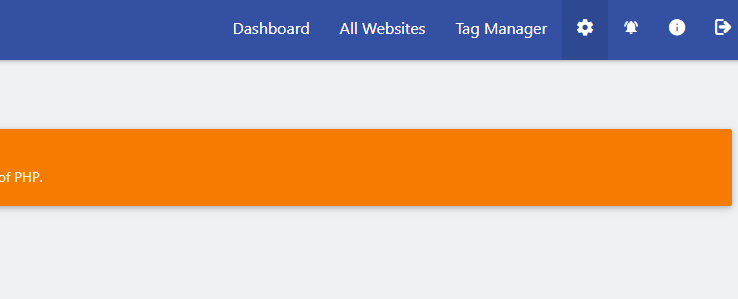
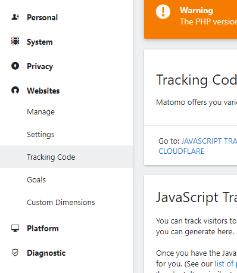
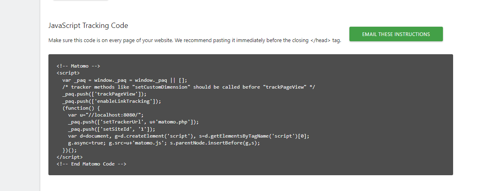
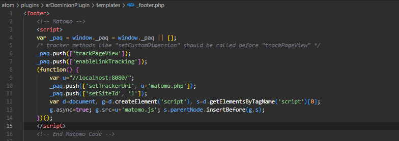
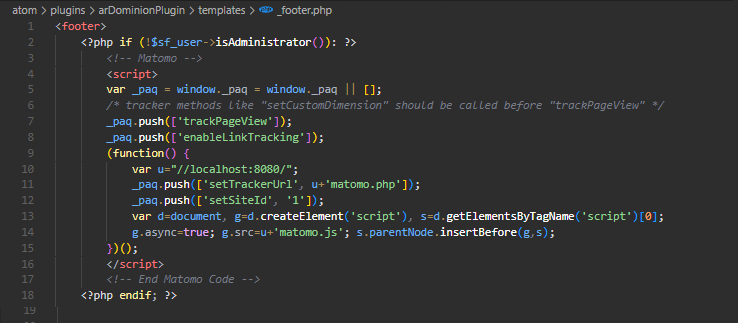
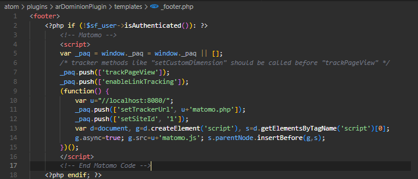

# Installation instructions for Matomo

Matomo is an open source platform, that allows for a free _On_Premise_ version, that you can download and install on your own server. These instructions will not go through how to install Matomo, assuming you already have the platform all set up. On their website, you can find the [installation instructions](https://matomo.org/faq/on-premise/installing-matomo/).

__1 - The tracking code__

When installing the software, a tracking code should be provided to you, but if not, or you're creating a new _site_ in the platform, you can get it by accessing _Administration_

And then _Websites->Tracking Code_

When opening it, a piece of code is presented to be copied and pasted into your site. Copy it and place it in the AtoM theme (see below - 2).

__2 - Placing the code in AtoM's site__

Now, you can take the code you copied and place it in the __footer.php_ file of your theme.  
If you don't have a theme setup, AtoM's default theme is _arDominionPlugin_, located in the _plugins_ folder of your AtoM installation. Now, ideally, you should create a new theme, based on the _arDominionPlugin_ and make the changes there (see https://accesstomemory.org/en/docs/2.7/admin-manual/customization/theming/#customization-theming on how to create it), or you can change the theme directly (**note that it will probably be overridden when you update Atom, so track the changes you make**).

**The __footer.php_ file**  
You may have noticed, if you've been following the instructions and making the changes at the same time, that there is no __footer.php_ file in the plugin folder. That's because any custom plugins, in _Symfony_ (the framework on what AtoM is built on) can override existing files. In the case of _AtoM_, the file needed to be overridden is located at _/apps/qubit/templates/\_footer.php_.

This means you have to recreate the path in the plugin, by creating a new folder called templates and a file, __footer.php_, inside.

After that, copy the original file's content (the one from _/app/qubit/\_footer.php_), and add, at the top, right below the _\<footer\>_ tag, the tracking code from the _Matomo_ dashboard setup.

Everything should be set up now.

__3 - Removing ourselves from the counts__

I'm not absolutely sure if, and how, is possible to remove the site's internal users from the total count of hits through the _Matomo_ administration, but, to prevent logged in users or administrators of the _AtoM_ instance from being counted, you can add checks to the code, like this:

**Removing Administrators**

**Removing authenticated users**

