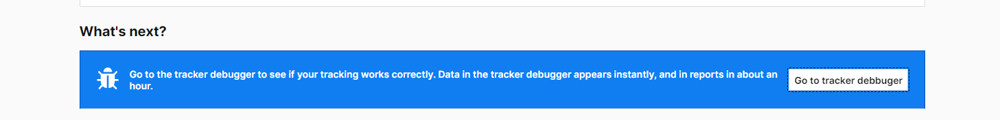

# Installation instructions for PiWik Pro

Installing Piwik Pro is straightforward. Create an account at https://piwik.pro/, add the tracking code to the theme, and be done.

__1 - The Piwik Pro account__

The non-paid version, called _Core Plan_, allows for up to 500.000 actions. An action is defined as follows:  
* Page view: a visitor visits a page
* Download: a visitor downloads a file
* Outlink: a visitor clicks the link to an external website
* Search: a visitor uses your internal search engine
* Custom event: a visitor performs a custom event
* Goal: a visitor completes a goal
* Loading a tag manager container
* Loading a consent manager window
* Uploading a line item
* Sending an API request

Not having used this platform, I cannot attest to how they add up at the end of the month; namely how many actions represent, on average, each action. So, I have no idea for how many visitors this plan is sufficient.

__2 - The account setup__

After adding your site, through the _Add site or app_ button, you'll be presented with your dashboard, with the following notice, stating that you have to install a _container_ for your site:

After clicking _Install now_, you'll be redirected to the _container_ settings page. **These can be changed later**. For now, the most important, and that will change the appearance of your site is located in the "Privacy" tab, and the first setting refers to an option to remove the consent form from the website. By default, it is turned on, which will show the consent form on your website. Its appearance can be edited through the _Consent Manager_ section.

The last tab is _Installation_ and you are presented with several pre-configured configurations for different platforms and technologies. In the case of AtoM, choose _Install manually_

When opening the _Install manually_ configuration, a piece of code is presented to be copied and pasted into your site. Copy it and place it in the AtoM theme (see below - 3).

Finally, an option to check if everything is correctly installed is presented at the bottom, the _Tracker debugger_, through which you can verify if all went well.

__3 - Placing the code in AtoM's site__

Now, you can take the code you copied earlier (or go back to the dashboard settings to get it), and place it in the __footer.php_ file of your theme.  
If you don't have a theme setup, AtoM's default theme is _arDominionPlugin_, located in the _plugins_ folder of your AtoM installation. Now, ideally, you should create a new theme, based on the _arDominionPlugin_ and make the changes there (see https://accesstomemory.org/en/docs/2.7/admin-manual/customization/theming/#customization-theming on how to create it), or you can change the theme directly (**note that it will probably be overridden when you update Atom, so track the changes you make**).

**The __footer.php_ file**  
You may have noticed, if you've been following the instructions and making the changes at the same time, that there is no __footer.php_ file in the plugin folder. That's because any custom plugins, in _Symfony_ (the framework on what AtoM is built on) can override existing files. In the case of _AtoM_, the file needed to be overridden is located at _/apps/qubit/templates/\_footer.php_.

This means you have to recreate the path in the plugin, by creating a new folder called templates and a file, __footer.php_, inside.

After that, copy the original file's content (the one from _/app/qubit/\_footer.php_), and add, at the top, right below the _\<footer\>_ tag, the code from the _Piwik_ dashboard setup.

Everything should be set up now, and you can check it on the _Tracker debugger_ page.

__4 - Removing ourselves from the counts__

I'm not absolutely sure if, and how, is possible to remove the site's internal users from the total count of hits through the _Piwik_ administration, but, to prevent logged in users or administrators of the _AtoM_ instance from being counted, you can add checks to the code, like this:

**Removing Administrators**

**Removing authenticated users**

